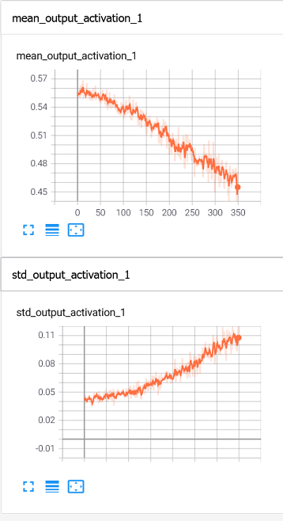

This is my own Scala implementation of gradient descent, forward and backward propagation. The purpose is to better 
understand how deep learning works.

I wanted it to be fast enough, so it was not only restricted to tiny things. 
That's why I'm using the [nd4j](https://github.com/eclipse/deeplearning4j) linear algebra libraries for the matrix 
multiplications.

The nd4j can make use of the CPU avx2 extensions as well as CUDA for the matrix multiplications. For the
mnist dataset it's not necessary (it's actually faster on cpu than gpu) but it will be useful for larger datasets

The provided example automatically downloads the mnist dataset into a temp folder and then trains it with 10 epochs and 
one hidden layer of 100 units. It achieves a 97% accuracy after 90 seconds.

Tons of things missing (convolutional layers, regularization, optimizers, ...) but you first need to get part way there
before reaching your destination.

The combination of callbacks from inside the DNN to the outer main (with debugging information) combined with the capability of writing tensorboard events log files makes understanding what's happening behind the curtains much easier:

```scala
val trackerCallback = new TrackingCallback {
      override def afterForward(layerId: String, inputs: INDArray, outputs: INDArray, batchNum: Int): Unit = {
        layerId match {
          case "activation_1" if batchNum < 350 =>
            w.write(myEvent("mean_output_activation_1", v = outputs.mean(0).getFloat(0L), step = batchNum).toByteArray)
            w.write(myEvent("std_output_activation_1", v = outputs.std(0).getFloat(0L), step = batchNum).toByteArray)
          case _ =>
        }
      }
    }
```

```scala
    val dnn = DNN.create(SquareLossFunction(), DefaultTracker())
````

